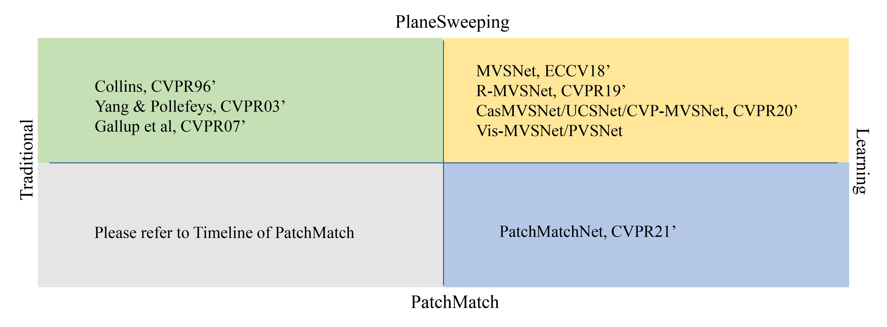

### Methods classification

#### Traditional PlaneSweeping

+ [A space-sweep approach to true multi-image matching](https://ieeexplore.ieee.org/document/517097)
+ [Multi-resolution real-time stereo on commodity graphics hardware](https://ieeexplore.ieee.org/document/1211356)
+ [Real-Time Plane-Sweeping Stereo with Multiple Sweeping Directions](https://ieeexplore.ieee.org/document/4270270)

#### Deep Learning (PlaneSweeping)
+ [Awesome-Learning-MVS](https://github.com/XYZ-qiyh/Awesome-Learning-MVS)

#### Traditional PatchMatch
+ [Awesome-PatchMatch-MVS](https://github.com/XYZ-qiyh/Awesome-PatchMatch-MVS)

#### Deep Learning (PatchMatch)
+ [PatchmatchNet: Learned Multi-View Patchmatch Stereo](https://arxiv.org/abs/2012.01411)
