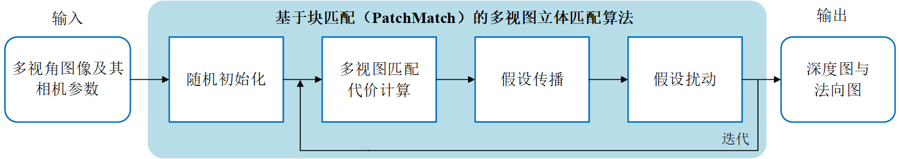
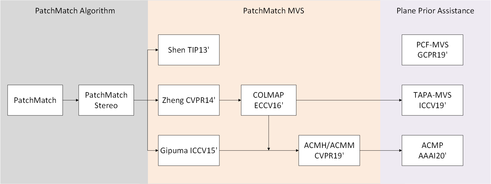

## Awesome-PatchMatch-MVS (Algorithms and Softwares)

### PatchMatch pipeline

### Timeline for PatchMatch MVS Algorithms

( 💻 means code available)

#### PatchMatch Stereo
+ 💻 [Patchmatch stereo-stereo matching with slanted support windows](https://www.microsoft.com/en-us/research/wp-content/uploads/2011/01/PatchMatchStereo_BMVC2011_6MB.pdf), BMVC 2011 [[code](https://github.com/ethan-li-coding/PatchMatchStereo)]

#### PatchMatch MVS
+ [Accurate multiple view 3d reconstruction using patch-based stereo for large-scale scenes](https://ieeexplore.ieee.org/abstract/document/6409456/), TIP 2013
+ [Patchmatch based joint view selection and depthmap estimation](https://ieeexplore.ieee.org/document/6909592/), CVPR 2014 [[video](https://www.youtube.com/watch?v=vxPZxdDYXYw)]
+ 💻 [Massively parallel multiview stereopsis by surface normal diffusion](https://www.cv-foundation.org/openaccess/content_iccv_2015/papers/Galliani_Massively_Parallel_Multiview_ICCV_2015_paper.pdf), ICCV 2015  [[code](https://github.com/kysucix/gipuma)] [[project](https://prs.igp.ethz.ch/research/projects/gipuma.html)]
+ 💻 [Pixelwise view selection for unstructured multi-view stereo](https://link.springer.com/content/pdf/10.1007%2F978-3-319-46487-9_31.pdf), ECCV 2016  [[code](https://github.com/colmap/colmap)] [[project](https://colmap.github.io/)] <!-- [[poster](https://www.microsoft.com/en-us/research/uploads/prod/2019/09/P-2A-41.pdf)]-->
+ 💻 [Multi-Scale Geometric Consistency Guided Multi-View Stereo](https://openaccess.thecvf.com/content_CVPR_2019/papers/Xu_Multi-Scale_Geometric_Consistency_Guided_Multi-View_Stereo_CVPR_2019_paper.pdf), CVPR 2019 [[ACMH](https://github.com/GhiXu/ACMH)] [[ACMM](https://github.com/GhiXu/ACMM)]

#### Plane Prior Assistance
+ [Tapa-mvs: Textureless-aware patchmatch multi-view stereo](https://openaccess.thecvf.com/content_ICCV_2019/papers/Romanoni_TAPA-MVS_Textureless-Aware_PAtchMatch_Multi-View_Stereo_ICCV_2019_paper.pdf), ICCV 2019 
+ [Plane completion and filtering for multi-view stereo reconstruction](https://www.researchgate.net/publication/335340045_Plane_Completion_and_Filtering_for_Multi-View_Stereo_Reconstruction), GCPR 2019 
+ 💻 [Planar prior assisted patchmatch multi-view stereo](https://ojs.aaai.org/index.php/AAAI/article/view/6940), AAAI 2020 [[ACMP](https://github.com/GhiXu/ACMP)]

#### 

### Multi-view Reconstruction Softwares
+ 💻 [MVE](https://github.com/simonfuhrmann/mve) (an image-based reconstruction environment)
+ 💻 [OpenMVG](https://github.com/openMVG/openMVG) (open Multiple View Geometry library)
+ 💻 [OpenMVS](https://github.com/cdcseacave/openMVS) (open Multi-View Stereo reconstruction library)
+ 💻 [COLMAP](https://github.com/colmap/colmap) (a general-purpose Structure-from-Motion and Multi-View Stereo pipeline) [[tools](https://github.com/XYZ-qiyh/colmap_sparse_recon)]

### More about PatchMatch for Multi-view Stereo

  
📃 PatchMatch for MVS (from Section 2 of TAPA-MVS paper) 

The PatchMatch seminal paper by [Barnes et al.](https://www.researchgate.net/profile/Eli-Shechtman/publication/220184392_PatchMatch_A_Randomized_Correspondence_Algorithm_for_Structural_Image_Editing/links/02e7e520897b12bf0f000000/PatchMatch-A-Randomized-Correspondence-Algorithm-for-Structural-Image-Editing.pdf) proposed a general method to efficiently compute an approximate nearest neighbor function defining the pixelwise correspondence among patches of two images. 
The idea is to use a collaborative search which exploits local coherency. 
PatchMatch initializes each pixel of an image with a random guess about the location of the nearest neighbor in the second image. 
Then, each pixel propagates its estimate to the neighboring pixels and, among these estimates, the most likely is assigned to the pixel itself. 
As a result the best estimates spread along the entire image.

[Bleyer et al.](https://www.microsoft.com/en-us/research/wp-content/uploads/2011/01/PatchMatchStereo_BMVC2011_6MB.pdf) re-framed this method into the stereo matching realm. Indeed, for each image patch, stereo matching looks in the second image for the corresponding patch, i.e. the nearest neighbor in the sense of photometric consistency. 
To improve its robustness the matching function is not limited to fixed sized squared windows, but it extends PatchMatch to estimate a pixel-wise plane orientation adopted to define the matching procedure on slanted support windows.
Heise et al. integrated the PatchMatch for stereo into a variational formulation to regularize the estimate with quadratic relaxation. This approach produces smoother depth estimates while preserving edges discontinuities.

The previous works successfully applied the PatchMatch idea to the pair-wise stereo matching problem. The natural extension to Multi-View Stereo was proposed by [Shen](https://ieeexplore.ieee.org/abstract/document/6409456/). Here the author selects a subset of camera pairs depending on the number of shared points computed by Structure from Motion and their mutual parallax angle. Then he estimates a depth map for the selected subset of camera pairs through a simplified version of the method of [Bleyer et al.](https://www.microsoft.com/en-us/research/wp-content/uploads/2011/01/PatchMatchStereo_BMVC2011_6MB.pdf).
The algorithm refines the depth maps by enforcing consistency among multiple views, and it finally merges the depth maps into a point cloud.

A different multi-view approach by [Galliani et al](https://www.cv-foundation.org/openaccess/content_iccv_2015/papers/Galliani_Massively_Parallel_Multiview_ICCV_2015_paper.pdf). modifies the PatchMatch propagation scheme in such a way that computation can better exploit the parallelization of GPUs. Differently, from [Shen](https://ieeexplore.ieee.org/abstract/document/6409456/), they aggregate, for each reference camera, a set of matching costs compute from different source images.
One of the major drawbacks of these approaches is the decoupled depth estimation and camera pairs selection.
[Xu and Tao](https://openaccess.thecvf.com/content_CVPR_2019/papers/Xu_Multi-Scale_Geometric_Consistency_Guided_Multi-View_Stereo_CVPR_2019_paper.pdf) recently proposed an attempt to overcome this issue; they extended with a more efficient propagation pattern and, in particular, their optimization procedure jointly considers all the views and all the depth hypotheses.

Rather than considering the whole set of images to compute the matching costs, [Zheng et al.](https://ieeexplore.ieee.org/document/6909592/) proposed an elegant method to deal with view selection. They designed a robust method framing the joint depth estimation and pixel-wise view selection problem into a variational approximation framework. Following a generalized Expectation Maximization paradigm, they alternate depth update with a PatchMatch propagation scheme, keeping the view selection fixed, and pixel-wise view inference with the forward-backward algorithm, keeping the depth fixed.

[Schonberger et al.](https://link.springer.com/content/pdf/10.1007%2F978-3-319-46487-9_31.pdf) extended this method to jointly estimate per-pixel depths and normals, such that,  differently from [Zheng et al.](https://ieeexplore.ieee.org/document/6909592/), the knowledge of the normals enables slanted support windows to avoid the fronto-parallel assumption. Then they add view-dependent priors to select views that more likely induce robust matching cost computation.

